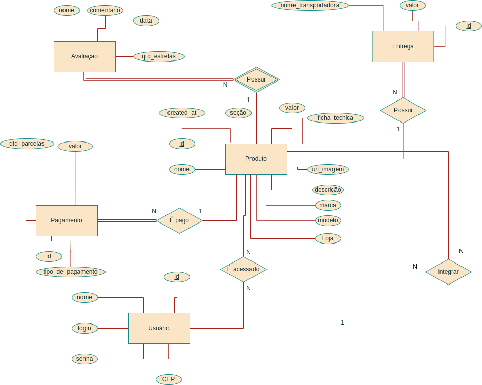

# Sistema de integração de preços

Alunos: João Vitor Ferreira e Wallacy Sebastian Aparecido Jeronimo de Almeida
* * *
Este sistema terá como objetivo capturar informações de produtos de diferentes sites de e-commerce, com o objetivo de compará-los em relação a preço e avaliações dos usuários.

## Sites e seções

A princípio, para este projeto, este sistema será capaz de capturar dados dos sites **Kabum**, **Americanas** e **Londritech**, com foco em duas seções: *Mouse* e *Monitor*.

## Informações a serem coletadas

Os dados a serem coletados serão em relação ao produto, como o nome, a descrição do produto, a URL da imagem, o valor e a seção à qual este pertence. Algumas outras informações relevantes sobre o produto são: as especificações, a avaliação, o tipo de pagamento, e quem entrega.

Sobre as especificações, pode-se obter em comum a marca e o modelo (para auxiliar na identificação do produto), e o restante da ficha técnica será coletado para ser exibido de forma descritiva, como a descrição.

A avaliação do produto é uma informação importante, pois servirá para comparar em qual e-commerce este produto possuirá mais ou menos problemas. Servirá como comparativo, junto com o preço. Os dados de avaliação coletados serão: o nome, o comentário (se houver), a data em que foi feita a avaliação e qual a nota da avaliação.

Por fim, o pagamento de um produto pode ser feito de várias formas, como cartão de crédito, cartão de débito, boleto, etc. Alguns tipos de pagamento possuem a opção de parcelamento, e alguns sites oferecem desconto de acordo com a quantidade de parcelas ou se o pagamento é feito à vista. Portanto, os dados coletados em relação ao pagamento será o tipo de pagamento, a quantidade de parcelas (se o tipo de pagamento oferecer isso) e o desconto ofertado de acordo com a quantidade de parcelas.

## Diagrama ER



[Link editável do diagrama](https://drive.google.com/file/d/1aGtF2vE7muIdesT2dGh71oujb8WyNCdS/view?usp=sharing)

## Implementação SQL

```sql
CREATE SCHEMA integracao_precos;

CREATE TABLE integracao_precos.produto (
	id SERIAL,
	nome VARCHAR(100),
	secao VARCHAR(50),
	url_imagem VARCHAR(255),
	descricao VARCHAR(500),
	valor FLOAT,
	CONSTRAINT pk_produto_id PRIMARY KEY(id)
);

CREATE TABLE integracao_precos.especificacoes (
	id_produto INT,
	modelo VARCHAR(50),
	marca VARCHAR(50),
	ficha_tecnica VARCHAR(500),
	CONSTRAINT fk_especificacoes_id_produto FOREIGN KEY(id_produto)
		REFERENCES integracao_precos.produto(id)
);

CREATE TABLE integracao_precos.avaliacao (
	id_produto INT,
	nome VARCHAR(50),
	comentario VARCHAR(255),
	data DATE,
	qtd_estrelas INT,
	CONSTRAINT fk_avaliacao_id_produto FOREIGN KEY(id_produto)
		REFERENCES integracao_precos.produto(id)
);

CREATE TABLE integracao_precos.transportadora (
	id_produto INT,
	nome VARCHAR(50),
	valor FLOAT,
	CONSTRAINT fk_transportadora_id_produto FOREIGN KEY(id_produto)
		REFERENCES integracao_precos.produto(id)
);

CREATE TABLE integracao_precos.pagamentos (
	id SERIAL,
	tipo_de_pagamento VARCHAR(50),
	CONSTRAINT pk_pagamentos_id PRIMARY KEY(id)
);

CREATE TABLE integracao_precos.pagamentos_parcelas (
	id_pagamento INT,
	qtd_parcelas INT,
	desconto VARCHAR(4),
	CONSTRAINT fk_pagamentos_id_pagamento FOREIGN KEY(id_pagamento)
		REFERENCES integracao_precos.pagamentos(id)
);

CREATE TABLE integracao_precos.usuario (
	id SERIAL,
	nome VARCHAR(50),
	login VARCHAR(20),
	senha VARCHAR(20),
	CONSTRAINT pk_usuario_id PRIMARY KEY(id)
);

```
